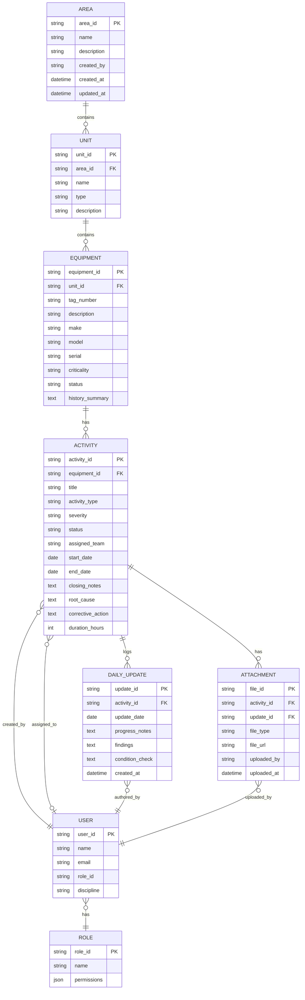
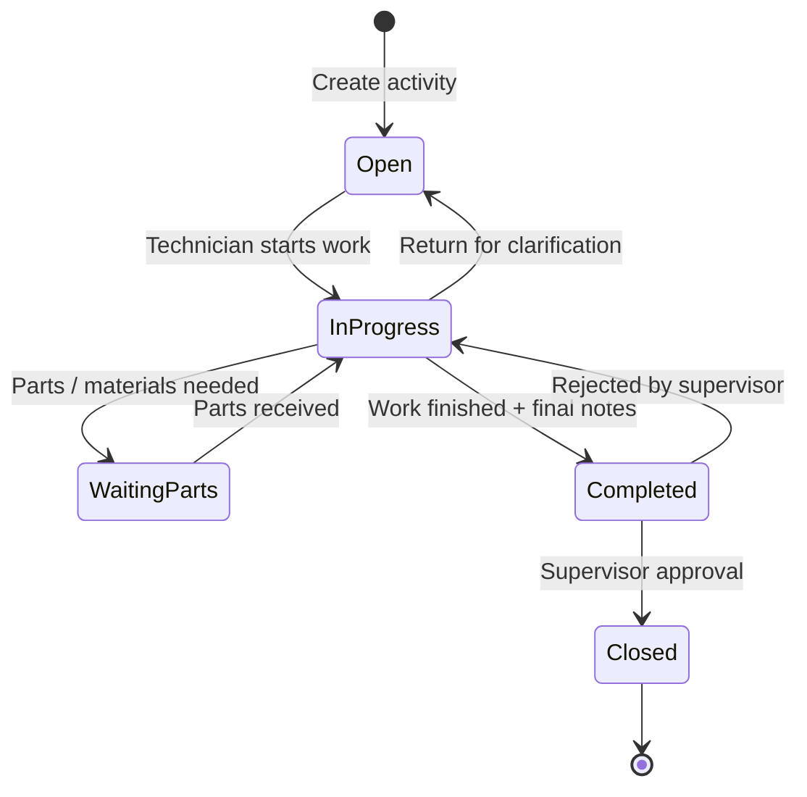
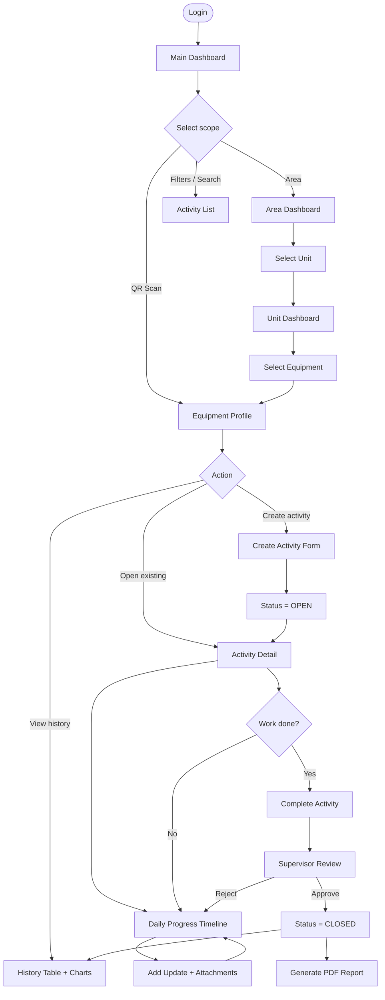
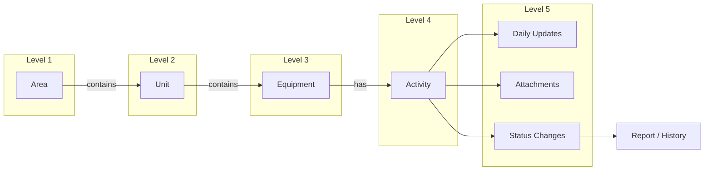
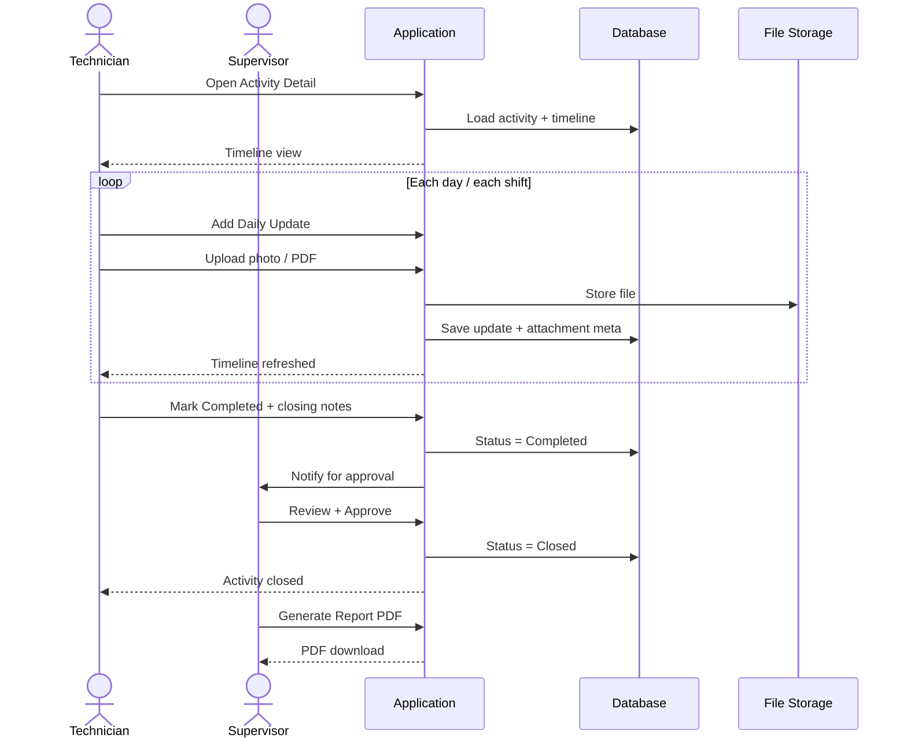
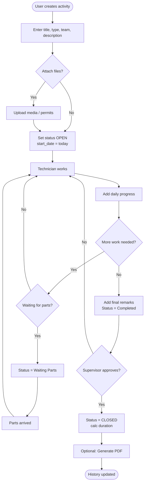
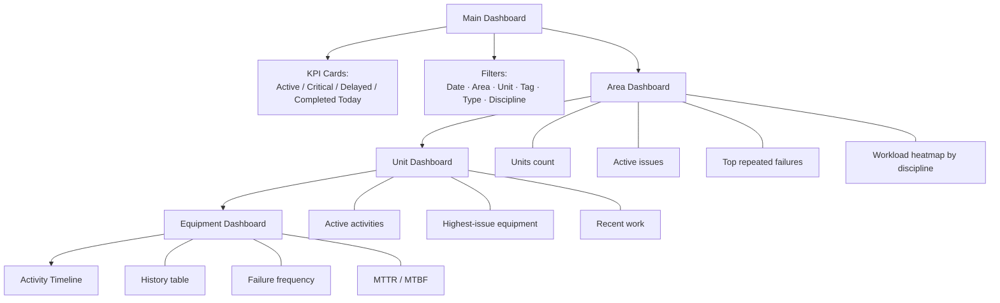
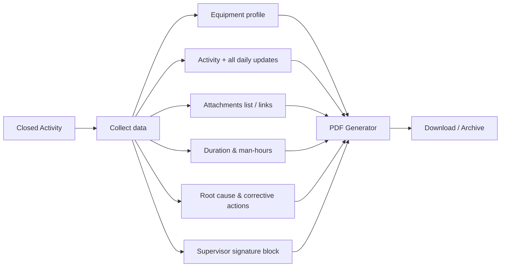
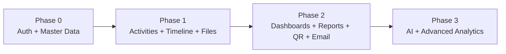

# Equipment History & Activity Tracking System

## Concept Plan, Data Model & Process Flows

**Status:** Concept / Planning  
**Core hierarchy:** Area → Unit → Equipment → Activities  
**Purpose:** Track maintenance history, daily progress, attachments, and reporting for plant/refinery equipment.

---

## 1. Vision (one sentence)

A hierarchical maintenance system where every piece of equipment has a living activity timeline — daily updates, files, status, and auto-generated reports — drilled from Area down to Equipment.

---

## 2. Organized Idea Map

| Theme | Ideas captured | Priority |
|-------|----------------|----------|
| **Hierarchy** | Area → Unit → Equipment → Activities | Core (MVP) |
| **Activities** | Types, severity, status workflow, team assignment | Core (MVP) |
| **Daily updates** | Unlimited progress entries (chat/timeline style) | Core (MVP) |
| **Files** | Photos, video, PDF, permits, manuals per activity | Core (MVP) |
| **Dashboards** | KPI cards + drilldown Area → Unit → Equipment | Core (MVP) |
| **Reports** | Auto PDF with history, duration, RCA, signature | Phase 2 |
| **QR codes** | Scan tag → open equipment history | Phase 2 |
| **Notifications** | Daily summary email to supervisors | Phase 2 |
| **AI** | Failure prediction, RCA suggestions | Phase 3 |
| **Analytics** | MTTR / MTBF, Power BI | Phase 2–3 |

---

## 3. System Hierarchy & Data Model

### 3.1 Entity relationship (logical)



### 3.2 Field dictionaries

#### Areas
| Field | Type | Notes |
|-------|------|-------|
| Area ID | Code | Unique (e.g. `A01`) |
| Area Name | Text | e.g. Heavy Oil Complex |
| Description | Text | Optional |
| Created By / Updated By | Audit | Required |

#### Units
| Field | Type | Notes |
|-------|------|-------|
| Unit ID | Code | Unique (e.g. `CDU`) |
| Unit Name | Text | e.g. Crude Distillation Unit |
| Area ID | FK | Parent Area |
| Type | Enum | Process / Utilities / Offsites / Other |

#### Equipment
| Field | Type | Notes |
|-------|------|-------|
| Equipment ID | Code | Unique |
| Tag Number | Text | Main plant identifier (e.g. `120P-001A`) |
| Description | Text | e.g. Crude Charge Pump |
| Unit ID | FK | Parent Unit |
| Make / Model / Serial | Text | Optional |
| Criticality | Enum | Low / Medium / High |
| Status | Enum | Running / Standby / Offline / Under Maintenance |
| History Summary | Text | Auto-generated from closed activities |

#### Activities
| Field | Type | Notes |
|-------|------|-------|
| Activity ID | Code | Unique |
| Equipment ID | FK | Parent Equipment |
| Title | Text | e.g. Pump Vibration High |
| Activity Type | Enum | Breakdown / PM / Inspection / Routine / Project |
| Severity | Enum | Low / Medium / High / Emergency |
| Status | Enum | See workflow below |
| Assigned Team | Enum | Rotating / Electrical / Instrument / Static / Ops / Vendor |
| Start Date | Date | Default: today |
| End Date | Date | Set on Completed |
| Daily Updates | Child rows | Unlimited |
| Attachments | Child rows | Images, videos, PDFs, permits |
| Closing Notes | Text | Final remarks |
| Duration | Calculated | End − Start (and/or man-hours) |

### 3.3 Activity status workflow



**Rules**
- Only **Closed** activities count as final history (for MTBF / reports).
- Duration auto-calculates when status → Completed (or Closed — decide in build).
- Waiting Parts does not clear assigned team.

---

## 4. Process Flow Diagrams

### 4.1 End-to-end user journey



### 4.2 Drilldown navigation (Area → Activity)



### 4.3 Daily update loop (core requirement)



### 4.4 Create → close activity (decision flow)



### 4.5 Dashboard information architecture



### 4.6 Report generation flow



---

## 5. Roles & Permissions (suggested)

| Role | Typical actions |
|------|-----------------|
| **Operator** | View equipment; create breakdown activities; add observations |
| **Technician** | Own assigned activities; daily updates; attachments; mark Completed |
| **Supervisor** | Approve/Close; reassign; area/unit dashboards; reports |
| **Planner / Reliability** | PM plans; analytics; MTTR/MTBF; criticality |
| **Admin** | Areas, Units, Equipment master data; users; roles |

---

## 6. Screen Inventory

| # | Screen | Purpose |
|---|--------|---------|
| 1 | Login | Auth (Azure AD / Google / custom) |
| 2 | Main Dashboard | Plant-wide KPIs + filters + drilldown entry |
| 3 | Area List / Area Dashboard | Units + area KPIs |
| 4 | Unit Dashboard | Equipment list + unit activity summary |
| 5 | Equipment Catalogue | Searchable tags under unit |
| 6 | Equipment Profile | Status, history, charts, Create Activity |
| 7 | Activity List | Filtered cross-hierarchy list |
| 8 | Activity Detail | Timeline of daily logs + status + files |
| 9 | Add Update | Progress / findings / checklist / attachments |
| 10 | Create Activity | New work order form |
| 11 | Reports | Generate / download PDF |
| 12 | Admin | Manage Areas, Units, Equipment, Users |

---

## 7. Dashboard Spec (matrix cards)

### Main Dashboard KPIs
- Total Active Tasks  
- Critical Tasks  
- Tasks Delayed (past target / SLA)  
- Completed Today  
- Breakdown by Discipline (Rotating, Elec, Inst, Static, Ops, Vendor)

### Filters
- Period: Today / Last Week / Last Month / Custom  
- Area / Unit / Tag  
- Type: PM / Breakdown / Inspection / Routine / Project  
- Severity / Status / Team

### Drill path
**Area → Unit → Equipment → Activity timeline**

---

## 8. File Management

| Aspect | Rule |
|--------|------|
| Supported | Photos, videos, PDFs, procedures, OEM manuals, work permits |
| Scope | Linked to Activity and optionally to a Daily Update |
| Metadata | Timestamp, uploader, file type, size |
| Storage | Object storage (S3 / Azure Blob); DB stores metadata + URL |
| Access | Same ACL as parent Activity |

---

## 9. Report Content (PDF)

1. Equipment details (tag, unit, area, criticality)  
2. Full activity description  
3. Chronological daily updates with dates/authors  
4. Attachment list (or embedded thumbnails / links)  
5. Duration & man-hours  
6. Root cause & corrective actions  
7. Supervisor approval signature / timestamp  

---

## 10. Smart Features (phased)

| Feature | Phase | Notes |
|---------|-------|-------|
| QR on equipment → open history | 2 | Encode Equipment ID / URL |
| Daily summary email (area-wise open tasks) | 2 | Cron + supervisor distribution list |
| Power BI / analytics export | 2 | Read replica or warehouse views |
| AI failure prediction | 3 | Needs enough closed history |
| Auto-suggest RCA | 3 | Prompt from symptoms + past similar activities |

---

## 11. Recommended Technology Stack

| Layer | Recommendation | Alternative |
|-------|----------------|-------------|
| Frontend | React (Next.js) or Flutter | — |
| Backend | Node.js or FastAPI | — |
| Database | PostgreSQL | SQL Server |
| Files | AWS S3 / Azure Blob | Local for MVP demo |
| Auth | Azure AD (plant SSO) | Google / custom JWT |
| Reports | Server-side PDF (e.g. Puppeteer / WeasyPrint) | — |
| Analytics | Built-in charts → Power BI later | — |

**MVP stack suggestion (web-first):** Next.js + PostgreSQL + S3-compatible storage + Azure AD.

---

## 12. Implementation Plan

### Phase 0 — Foundations
- Auth + roles  
- Master data CRUD: Area, Unit, Equipment  
- Seed sample plant hierarchy  

### Phase 1 — MVP Core
- Activity CRUD + status workflow  
- Daily updates timeline  
- Attachments upload  
- Equipment history list  
- Basic Main / Area / Unit / Equipment views  
- Filters: area, unit, type, status  

### Phase 2 — Operations
- Supervisor close / approval  
- PDF report generation  
- KPI dashboards + delay logic  
- Email daily summary  
- QR deep links  
- MTTR / MTBF calculations  

### Phase 3 — Intelligence
- Recurrence charts & reliability insights  
- AI RCA suggestions  
- Failure prediction  
- External BI integration  

### Build order (dependency)



---

## 13. Key Business Rules (decide before coding)

1. **Who can Close?** Supervisor only (recommended).  
2. **Duration clock:** Start → Completed, or Start → Closed?  
3. **Delayed definition:** No update in N days, or past planned end date?  
4. **Equipment status sync:** Auto-set “Under Maintenance” when activity Open/In Progress?  
5. **One open Breakdown per equipment?** Soft warning vs hard block.  
6. **History Summary:** Auto-text from last N closed activities.  
7. **Man-hours:** Free text per update vs structured time entry.  

---

## 14. Success Metrics

| Metric | Why it matters |
|--------|----------------|
| % activities with daily updates | Adoption of timeline discipline |
| Mean time Open → Closed | Responsiveness |
| MTTR / MTBF by equipment class | Reliability |
| Critical open > SLA | Risk visibility |
| Reports generated / month | Handover & audit value |

---

## 15. Workflow Summary (canonical)

```
Area
  └─ Units
       └─ Equipment
            └─ Activities
                 ├─ Daily Progress
                 ├─ Attachments
                 ├─ Status Updates
                 └─ Completion → Reporting → History
```

---

## 16. Next Steps (product decisions)

1. Confirm **web vs mobile-first** (or both: PWA / Flutter later).  
2. Lock **status names** and **delayed** rule.  
3. Provide sample Area / Unit / Tag list for seed data.  
4. Choose auth provider (Azure AD recommended for plant).  
5. Start Phase 0 schema + Admin screens.

---

*Document derived from the full app concept: hierarchy, process flow, dashboards, files, reports, smart features, stack, and screen list.*
