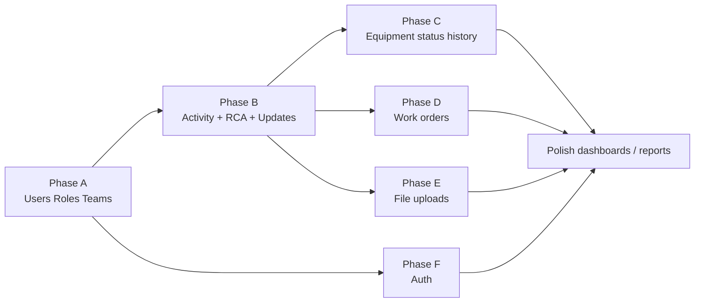

# ERD v1 vs Live Lineage Schema — Gap Analysis & Migration Plan

**Date:** 2026-09-21  
**Source ERD:** Equipment History & Activity Tracking — ERD (v1) (2026-02-17)  
**Live app:** https://alkinda.com/lineage (Hostinger MySQL `u337841818_lineage`)  
**Current schema:** `db/schema.mysql.sql` (6 tables)

---

## 1. Verdict (short)

**We do not have the same thing.**

The **core hierarchy is the same** (Area → Unit → Equipment → Activities → Updates/Attachments), but the attached ERD is a fuller product model. Our live DB is an **MVP subset** with string enums and free-text authors instead of real Users / Teams / Roles, and it is **missing** several ERD tables entirely.

| Area | Match? |
|------|--------|
| Area → Unit → Equipment hierarchy | Yes (same idea) |
| Activities on equipment | Yes (simplified) |
| Daily / activity updates | Partial (`daily_updates` ≈ `ActivityUpdates`) |
| Attachments on activities | Partial |
| Users / Roles / Teams | **No** |
| WorkOrders | **No** |
| EquipmentStatusHistory | **No** (status is a column on equipment only) |
| RootCauseAnalysis (own table) | **No** (RCA fields denormalized on `activities`) |
| Integer PKs + timestamptz style | **No** (we use VARCHAR codes + MySQL TIMESTAMP) |

---

## 2. Side-by-side entity map

### 2.1 Tables in ERD vs live

| ERD table | Live table | Status |
|-----------|------------|--------|
| Areas | `areas` | Present — close |
| Units | `units` | Present — close |
| Equipment | `equipment` | Present — partial |
| Activities | `activities` | Present — partial |
| ActivityUpdates | `daily_updates` | Present — partial |
| Attachments | `attachments` | Present — partial |
| Users | — | **Missing** |
| Roles | — | **Missing** |
| Teams | — | **Missing** |
| WorkOrders | — | **Missing** |
| EquipmentStatusHistory | — | **Missing** |
| RootCauseAnalysis | (columns on `activities`) | **Missing as table** |

**Live only extras (not in ERD):** `equipment.status`, `equipment.serial`, `equipment.history_summary`, `activities.closing_notes`, `activities.duration_hours`, `daily_updates.findings`, `daily_updates.condition_check`, `attachments.update_id`, `attachments.file_url`.

### 2.2 Relationship parity

```
ERD                                      Live today
────                                     ──────────
Areas 1─N Units                          ✅ same
Units 1─N Equipment                      ✅ same
Equipment 1─N Activities                 ✅ same
Equipment 1─N EquipmentStatusHistory     ❌ none
Activities 1─N ActivityUpdates           ✅ as daily_updates
Activities 1─N Attachments               ✅ same idea
Activities 1─N WorkOrders                ❌ none
Activities 1─0..1 RootCauseAnalysis      ❌ RCA inline on activities
Teams 1─N Activities (assigned_team_id)  ❌ ENUM string on activities
Users 1─N Activities (opened_by)         ❌ free-text created_by
Users 1─N ActivityUpdates (updated_by)   ❌ free-text author
Users 1─N Attachments (uploaded_by)      ❌ free-text uploaded_by
Roles 1─N Users                          ❌ none
Teams 1─N Users                          ❌ none
```

---

## 3. Field-level gaps (important ones)

### Areas / Units
| ERD | Live | Action |
|-----|------|--------|
| `area_id` int PK | `id` VARCHAR | Keep VARCHAR plant codes (`A01`) **or** add surrogate int + business code |
| `unit_id` int PK | `id` VARCHAR (`CDU`) | Same decision |
| — | `updated_by` / `updated_at` on areas | Keep (useful audit) |

**Recommendation:** Keep human-readable codes as primary keys for plant tags (A01, CDU, EQ-…). Add optional `legacy_int` only if reporting tools demand ints. Do **not** force int PKs for hierarchy unless required.

### Equipment
| ERD | Live | Action |
|-----|------|--------|
| `make_model` single text | `make` + `model` + `serial` | Keep split fields (richer); map `make_model` as generated/view if needed |
| no current status column | `status` ENUM on row | Keep current status **and** add `equipment_status_history` |
| `criticality` text | ENUM | Keep ENUM |
| `tag_number` UQ | ✅ UQ | Keep |

### Activities
| ERD | Live | Action |
|-----|------|--------|
| `priority` | `severity` | Rename conceptually to `priority` **or** keep `severity` and treat as priority |
| `assigned_team_id` FK → Teams | `assigned_team` ENUM | Migrate to `teams.id` FK |
| `opened_by` FK → Users | `created_by` VARCHAR | Migrate to `users.id` FK |
| `opened_at` / `closed_at` timestamptz | `start_date` / `end_date` DATE | Promote to DATETIME; keep date views for UI |
| — | `root_cause`, `corrective_action` on row | Move into `root_cause_analysis` table |

### ActivityUpdates ↔ daily_updates
| ERD | Live | Action |
|-----|------|--------|
| `updated_by` FK | `author` VARCHAR | Migrate to user FK (+ display name join) |
| `note` | `progress_notes` | Align name or keep alias |
| `progress_pct` int | — | **Add** |
| — | `findings`, `condition_check`, `update_date` | Keep (valuable for plant ops) |

### Attachments
| ERD | Live | Action |
|-----|------|--------|
| `file_size` | — | **Add** |
| `uploaded_by` FK | VARCHAR | Migrate to user FK |
| storage path implicit | `file_url` | Keep `file_url` (needed for Hostinger/object storage) |
| — | `update_id` optional FK | Keep (link file to a specific daily update) |

---

## 4. Target architecture (aligned to ERD, Hostinger-safe)

Keep Hostinger **MySQL**. Adapt ERD types:

| ERD type | MySQL choice |
|----------|--------------|
| `int` PK | `INT AUTO_INCREMENT` for org tables; VARCHAR codes for plant hierarchy |
| `text` | `VARCHAR` / `TEXT` |
| `timestamptz` | `DATETIME(3)` stored UTC (MySQL has no true timestamptz) |
| `json` | `JSON` |
| `bool` | `TINYINT(1)` |

### Target table list (12 ERD + live keepers)

1. `areas` (evolve)  
2. `units` (evolve)  
3. `equipment` (evolve)  
4. `equipment_status_history` **(new)**  
5. `roles` **(new)**  
6. `teams` **(new)**  
7. `users` **(new)**  
8. `activities` (evolve)  
9. `activity_updates` (rename/evolve from `daily_updates`)  
10. `attachments` (evolve)  
11. `work_orders` **(new)**  
12. `root_cause_analysis` **(new)**  

---

## 5. Phased migration plan (necessary changes)

Do **not** big-bang replace the live app. Migrate in phases so alkinda.com stays up.

### Phase A — Org foundation (Users / Roles / Teams)
**Goal:** Real identity instead of free-text names.

1. Create `roles`, `teams`, `users`.
2. Seed roles: Operator, Technician, Supervisor, Admin.
3. Seed teams: Rotating, Electrical, Instrument, Static, Ops, Vendor.
4. Seed a bootstrap Admin user (you).
5. Add nullable FKs alongside current VARCHAR columns:
   - `activities.opened_by_user_id`
   - `daily_updates.updated_by_user_id`
   - `attachments.uploaded_by_user_id`
6. Backfill from string authors where possible; keep VARCHAR as display fallback until auth ships.
7. UI: show user name from join; Admin screen to manage users/teams.

**App impact:** Auth prep, activity create/update writers use user id when session exists.

### Phase B — Align activity model to ERD
**Goal:** Activities match ERD semantics without breaking UI.

1. Add `opened_at`, `closed_at` DATETIME (backfill from `start_date`/`end_date`).
2. Add `assigned_team_id` FK → `teams` (backfill from ENUM).
3. Keep `severity` **or** rename to `priority` with a DB view for old name.
4. Create `root_cause_analysis` (1:0..1). Migrate existing `root_cause` / `corrective_action` rows.
5. Rename `daily_updates` → `activity_updates` (or create new table + copy + swap).
6. Add `progress_pct` to updates.
7. Update `lib/data/*` mappers and writers.

**App impact:** Activity detail shows RCA panel; updates show % progress.

### Phase C — Equipment status history
**Goal:** Status changes are auditable (ERD `EquipmentStatusHistory`).

1. Create `equipment_status_history`.
2. On every equipment status change (and when activity opens/completes), insert history row.
3. Seed one history row per equipment from current `equipment.status`.
4. Equipment profile UI: status timeline.

### Phase D — Work orders
**Goal:** Link CMMS / external WO numbers.

1. Create `work_orders` (`external_ref` UNIQUE, planned start/finish, status).
2. Activity detail: list / attach WO references.
3. Optional filter on dashboard by WO.

### Phase E — Attachments hardening
**Goal:** Match ERD + real file storage.

1. Add `file_size`; keep `file_url`.
2. `uploaded_by` → user FK.
3. Implement upload to Hostinger storage / local `public/uploads` with disk quota rules.
4. Serve links from activity detail (replace `#` placeholders).

### Phase F — Auth gate
**Goal:** ERD Users/Roles become enforceable.

1. Login (session/JWT) against `users`.
2. Permission checks from `roles.permissions_json`.
3. Replace “QA Agent / Operator” free text with session user.
4. Supervisor-only: Close activity + verify RCA.

---

## 6. Suggested implementation order (practical)



**Recommended next build slice:** **Phase A + thin Phase B** (teams FK + opened_by user FK + RCA table), then auth.

---

## 7. Data migration rules (non-negotiable)

1. **No downtime if possible** — additive columns/tables first; dual-write; then cut over.
2. **Preserve live E2E data** (`ACT-73D733`, seed activities, areas A01–A03).
3. **Keep Hostinger MySQL** — do not switch to Postgres for ERD’s `timestamptz`.
4. **Plant codes stay stable** — `A01`, `CDU`, `120P-001A` must not break URLs (`/lineage/areas/A01`, tags).
5. Every migration ships as:
   - `db/migrations/00N_*.sql`
   - updated `db/schema.mysql.sql` (canonical)
   - app mapper/writer updates
   - live verify script / health checks

---

## 8. Compatibility matrix for the running app

| Feature live today | After full ERD alignment |
|--------------------|--------------------------|
| Portal + Lineage UI | Unchanged routes |
| MySQL reads | Join Users/Teams |
| Create activity | Requires equipment + optional team/user |
| Daily update | User FK + progress % |
| Mark completed | Sets `closed_at`; optional RCA prompt |
| Mock fallback | Keep for local without DB |
| ENUM teams in UI | Become Teams dropdown from DB |

---

## 9. Effort / risk (technical, not calendar)

| Phase | Invasiveness | Risk | Notes |
|-------|--------------|------|-------|
| A Org tables | Medium | Low | Additive; dual columns |
| B Activity align | Medium–High | Medium | Rename/migrate updates carefully |
| C Status history | Low–Medium | Low | Trigger or app-level write |
| D Work orders | Low | Low | New feature surface |
| E Uploads | Medium | Medium | Storage + size limits on Hostinger |
| F Auth | High | Medium | Touches every write path |

---

## 10. Decision checklist (need your call before coding)

1. **IDs:** Keep VARCHAR plant codes for Area/Unit/Equipment, or switch hierarchy to int PKs?  
   → **Proposal: keep VARCHAR codes.**
2. **Priority vs severity:** Rename to ERD `priority`, or keep `severity`?  
   → **Proposal: keep `severity`, treat as priority in UI.**
3. **Rename `daily_updates` → `activity_updates` now or later?**  
   → **Proposal: rename in Phase B with a migration copy.**
4. **Auth provider:** Custom email/password first, or Hostinger-friendly simple session?  
   → **Proposal: simple credentials in `users` + httpOnly session cookie.**
5. **Work orders & RCA:** same release as Users, or after auth?  
   → **Proposal: RCA with Phase B; Work orders after auth.**

---

## 11. Immediate next step (when you approve)

**Phase A kickoff:**
1. Write `db/migrations/001_org_users_roles_teams.sql`
2. Apply on Hostinger `u337841818_lineage`
3. Seed roles/teams + your admin user
4. Add nullable user/team FKs on activities/updates/attachments
5. Update create-activity / add-update to prefer FKs
6. Deploy + verify on alkinda.com

---

## 12. Summary

The attached ERD is the **target professional model**.  
What we have live is a **working MVP slice** of that model (hierarchy + activities + updates + attachments), already useful on alkinda.com.

**Necessary changes** = introduce Users/Roles/Teams, status history, work orders, proper RCA entity, tighten FKs/audit fields, then auth and file uploads — in that phased order so nothing on production breaks.

*Awaiting your decisions on section 10 before implementation.*
